# Student Attendance Management System

A full-stack university attendance management platform for **Computer Science & Engineering (CSE)** departments. It supports daily attendance marking, course enrollment, class routines, announcements, reports, and public student lookup — with role-based access for administrators, class representatives (CRs), and students.

---

## Table of Contents

1. [Overview](#overview)
2. [Architecture](#architecture)
3. [Tech Stack](#tech-stack)
4. [Project Structure](#project-structure)
5. [User Roles & Permissions](#user-roles--permissions)
6. [Application Modes](#application-modes)
7. [Features by Role](#features-by-role)
8. [Core Workflows](#core-workflows)
9. [Database Schema](#database-schema)
10. [API Reference](#api-reference)
11. [Authentication & Security](#authentication--security)
12. [Environment Variables](#environment-variables)
13. [Setup & Development](#setup--development)
14. [Database & Seeding](#database--seeding)
15. [Scripts Reference](#scripts-reference)
16. [Deployment](#deployment)

---

## Overview

| Property | Value |
|----------|-------|
| **Purpose** | Track and report student class attendance for a university CSE department |
| **Department** | Computer Science & Engineering |
| **Sections** | A, B, C, D, E, F |
| **Semesters** | 1–8 (configurable up to 12) |
| **Attendance threshold** | 75% (configurable in system settings) |
| **Default app mode** | `general` (attendance-first UI) |

The system is tailored for **NUBTK** (Northern University Bangladesh) CSE data — routines, faculty, section representatives, and course catalogs can be imported via the seed script from parsed markdown sources.

---

## Architecture

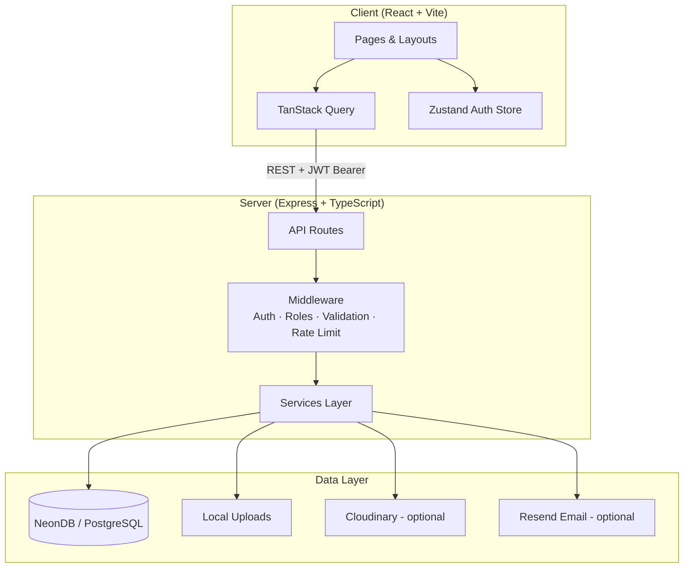

### Request lifecycle

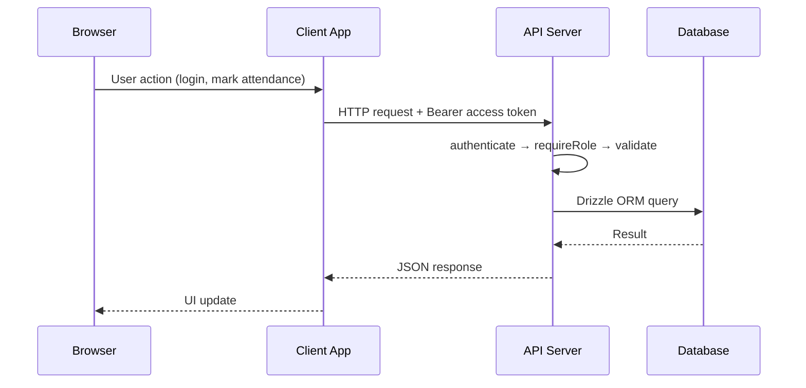

### Frontend route map

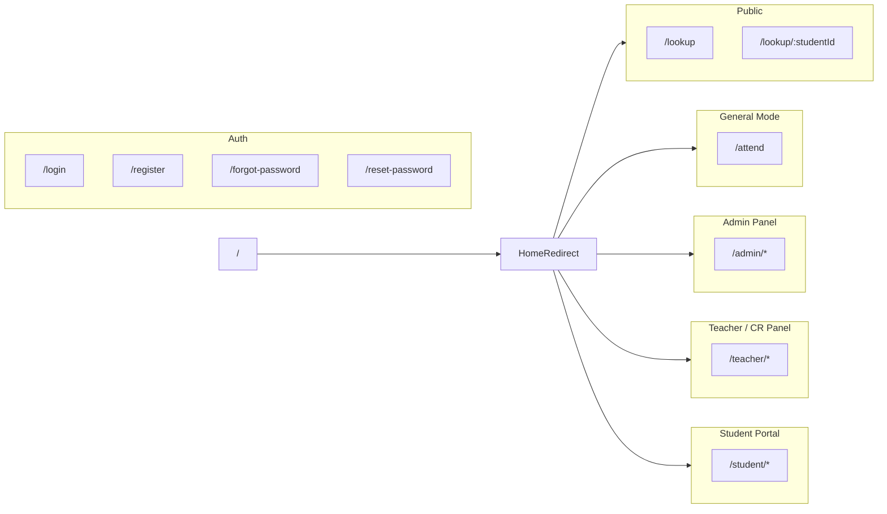

---

## Tech Stack

### Frontend (`client/`)

| Layer | Technology |
|-------|------------|
| Framework | React 19, TypeScript |
| Build | Vite 8 |
| Styling | Tailwind CSS 3, shadcn/ui |
| State | Zustand (auth), TanStack Query (server state) |
| Forms | React Hook Form + Zod |
| Routing | React Router 7 |
| Charts | Recharts |
| Animation | Framer Motion |
| Rich text | TipTap (announcements) |
| Notifications | Sonner |

### Backend (`server/`)

| Layer | Technology |
|-------|------------|
| Runtime | Node.js, Express 5 |
| Language | TypeScript |
| ORM | Drizzle ORM |
| Database | NeonDB (serverless PostgreSQL) |
| Auth | JWT (access) + HTTP-only refresh cookie |
| Password hashing | bcryptjs |
| File uploads | Multer (local) / Cloudinary (optional) |
| Email | Resend (password reset) |
| Security | Helmet, CORS, express-rate-limit |

---

## Project Structure

```
Attendence Management/
├── client/                          # React frontend
│   ├── src/
│   │   ├── components/              # Shared UI components
│   │   ├── config/                  # Academic constants, nav config
│   │   ├── hooks/                   # useAuth, useAppMode, useStaffPermissions
│   │   ├── layouts/                 # Auth, Admin, Teacher, Student, Public, General
│   │   ├── pages/
│   │   │   ├── admin/               # Staff admin pages (shared with teacher)
│   │   │   ├── auth/                # Login, register, password reset
│   │   │   ├── general/             # General-mode attendance page
│   │   │   ├── public/              # Public lookup & profiles
│   │   │   └── student/             # Student portal pages
│   │   ├── routes/                  # ProtectedRoute, redirects
│   │   ├── services/                # API client & endpoints
│   │   └── types/                   # TypeScript interfaces
│   └── package.json
│
├── server/                          # Express backend
│   ├── src/
│   │   ├── config/                  # env, db, constants
│   │   ├── controllers/             # Route handlers
│   │   ├── data/nubtk/              # NUBTK seed data & parsers
│   │   ├── middleware/              # auth, roles, validation, errors
│   │   ├── models/                  # Drizzle schema
│   │   ├── routes/                  # API route definitions
│   │   ├── scripts/                 # Database seed scripts
│   │   ├── services/                # Business logic
│   │   └── utils/                   # JWT, dates, uploads, responses
│   └── package.json
│
├── .env.example                     # Environment variable template
└── PROJECT.md                       # This file
```

---

## User Roles & Permissions

```mermaid
flowchart TD
    Admin[Admin]
    Teacher[Teacher / CR]
    Student[Student]
    Public[Public - unauthenticated]

    Admin -->|Full access| AllData[All departments, semesters, sections]
    Admin -->|Any date| AttendancePast[Mark attendance on any date]
    Admin -->|CRUD| Students[Create / update / delete students]
    Admin -->|CRUD| Courses[Courses, sessions, routine, settings]

    Teacher -->|Scoped| Scope[Own department + semester + section]
    Teacher -->|Today only| AttendanceToday[Mark attendance for today only]
    Teacher -->|Read/Write| ScopedStudents[View & mark scoped students]
    Teacher -->|No delete| NoStudentDelete[Cannot delete students]

    Student -->|Own data| Self[Profile, courses, attendance, routine]
    Student -->|Enroll/Drop| Courses2[Available & retake courses]

    Public -->|Read only| Lookup[Student lookup by roll number]
```

### Role matrix

| Capability | Admin | Teacher / CR | Student | Public |
|------------|:-----:|:------------:|:-------:|:------:|
| Dashboard & analytics | ✅ | ✅ (scoped) | ✅ | — |
| Mark attendance | ✅ (any date) | ✅ (today only) | — | — |
| View students | ✅ (all) | ✅ (scoped) | — | — |
| Create/edit/delete students | ✅ | ❌ | — | — |
| Manage courses & sessions | ✅ | ✅ (scoped courses) | — | — |
| Manage routine | ✅ | ✅ (view via panel) | View own | — |
| Announcements | ✅ | ✅ | View targeted | — |
| Reports | ✅ | ✅ (scoped) | — | — |
| System settings | ✅ | ❌ | — | — |
| Profile & avatar | ✅ | ✅ | ✅ | — |
| Course enrollment | — | — | ✅ | — |
| Public student lookup | — | — | — | ✅ |

### CR (Class Representative) scope

CR accounts are stored as `teacher` role users with `staffType: 'cr'`. Each CR is bound to:

- **Department:** Computer Science & Engineering
- **Semester:** e.g. 8
- **Section:** e.g. E

They share the teacher UI and API permissions but cannot access other semesters or sections. The seed script creates one CR account per semester × section combination (48 total for semesters 1–8 × sections A–F).

---

## Application Modes

The system supports two runtime modes controlled by the `app_mode` system setting:

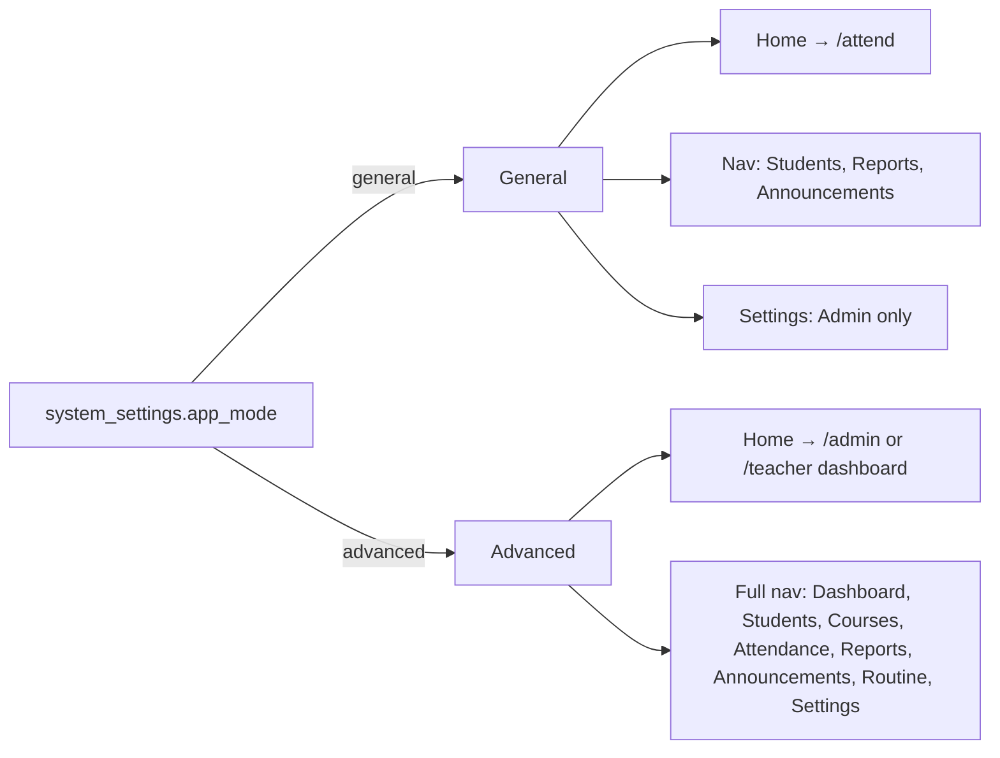

| Mode | Staff home route | Visible navigation |
|------|------------------|-------------------|
| **general** | `/attend` | Students, Reports, Announcements (+ Settings for admin) |
| **advanced** | `/admin/dashboard` or `/teacher/dashboard` | Full staff navigation |

Students always land on `/student/dashboard` regardless of mode.

Unauthenticated visitors are redirected to `/lookup` (public student search).

---

## Features by Role

### Admin

- **Dashboard** — Overview stats, attendance trends, today's sessions, low-attendance alerts
- **Students** — Search, filter, create, edit, delete; view detailed profiles with attendance history
- **Courses** — Manage course catalog, assign teachers, enroll students
- **Attendance** — Session-based attendance sheets; mark present, absent, late, or excused
- **Reports** — Filterable attendance reports, course-wise stats, trend charts, defaulter lists
- **Announcements** — Create pinned announcements targeted to all, department, or section
- **Routine** — Weekly class schedule management with import support
- **Settings** — Attendance threshold, academic year, current semester, app mode

### Teacher / CR

- Same staff panel as admin (under `/teacher/*`) with **scope restrictions**
- Semester and section filters are locked to their profile
- Attendance can only be submitted for **today's date**
- Cannot create, update, or delete students
- Cannot change system settings (except admin in general mode)

### Student

- **Dashboard** — Attendance summary, upcoming classes, announcements
- **Attendance** — Per-course attendance history and percentage
- **Courses** — View enrolled courses; enroll in available or retake courses
- **Routine** — Personal weekly class schedule
- **Announcements** — Filtered by targeting rules
- **Profile** — Update contact info, upload avatar
- **Notifications** — Low attendance alerts, announcements, reminders

### Public (no login)

- **Lookup** (`/lookup`) — Search students by roll number
- **Public profile** (`/lookup/:studentId`) — View attendance summary and course stats

---

## Core Workflows

### 1. Authentication flow

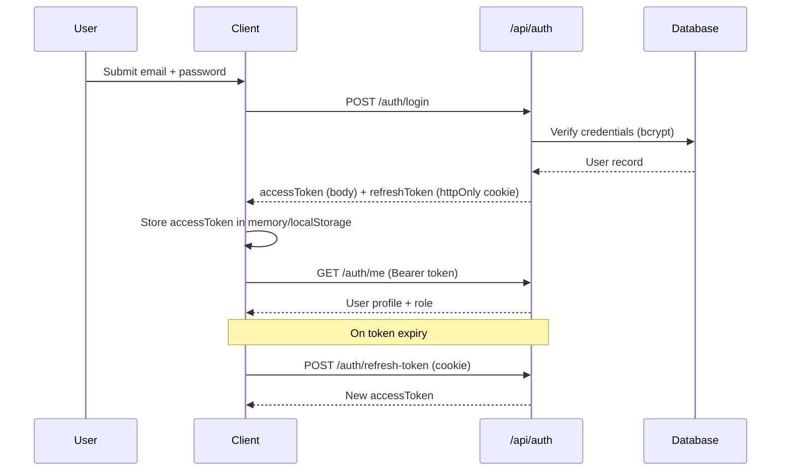

**Supported auth operations:**

- Login / logout
- Token refresh (HTTP-only cookie on `/api/auth` path)
- Student self-registration (when `ALLOW_STUDENT_REGISTER=true`)
- Admin/teacher registration (when `ALLOW_ADMIN_REGISTER=true`)
- Forgot password → email via Resend → reset with token
- Change password (authenticated)

**Login normalization** (server-side): numeric-only input is treated as a student ID and expanded to `{id}@gmail.com`. CR shortcuts like `cr8e` resolve to the scoped CR email format.

---

### 2. Attendance marking workflow

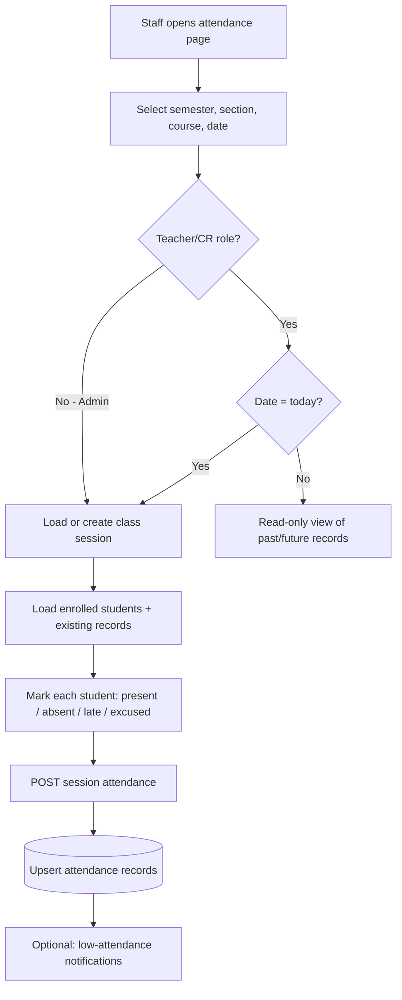

**Attendance statuses:** `present`, `absent`, `late`, `excused`

**Rules:**

- One attendance record per student per session (unique constraint)
- Teachers/CRs: session date must equal today
- Admins: can manage any date
- Students must be enrolled in the course to appear on the sheet
- Teachers/CRs can only mark students within their scope

**General mode UI** (`/attend`):

- Calendar strip for date navigation (14 days past, 7 days future)
- Quick present/absent toggles per student
- Locked semester/section for CR accounts

---

### 3. Course enrollment workflow (student)

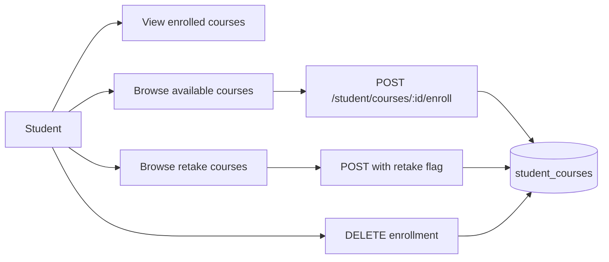

Enrollment links a student to a course. Only enrolled students appear on attendance sheets for that course's sessions.

---

### 4. Announcement workflow

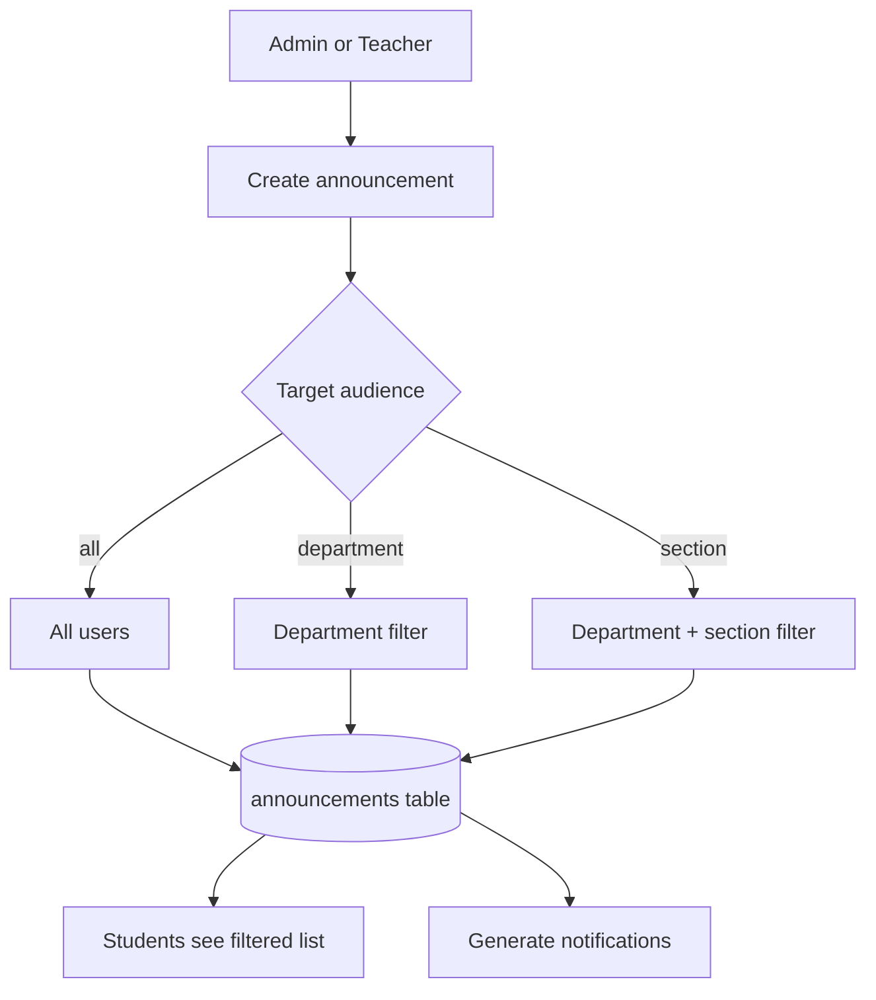

---

### 5. Report generation workflow

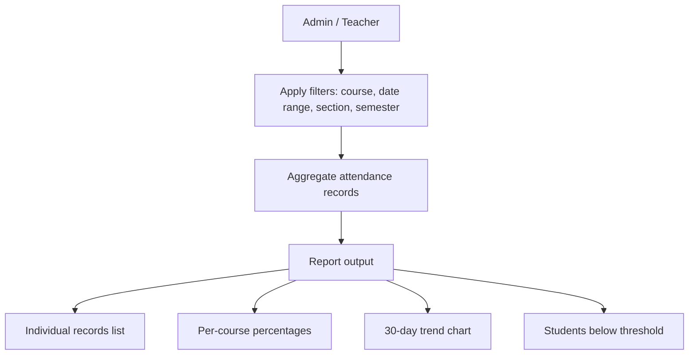

Default attendance threshold: **75%** (configurable via Settings).

---

### 6. Public lookup workflow

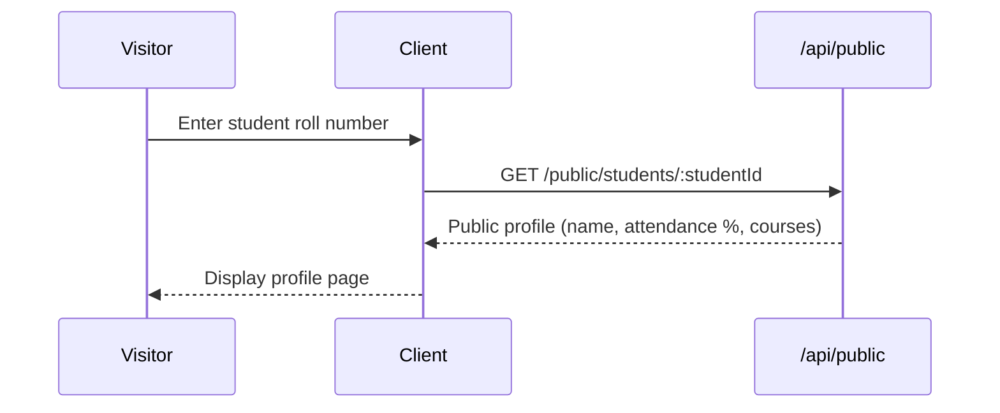

No authentication required. Rate-limited in production (30 requests/minute).

---

## Database Schema

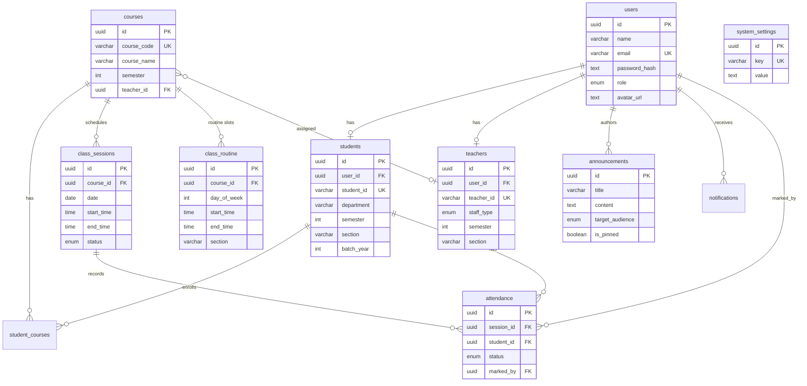

### Supporting tables

| Table | Purpose |
|-------|---------|
| `academic_faculty` | Faculty directory (acronym, name, designation, contact) |
| `section_representatives` | CR/ACR contact records per section |
| `refresh_tokens` | Hashed refresh tokens for session renewal |
| `password_reset_tokens` | Hashed tokens for password reset flow |
| `notifications` | In-app notifications per user |

---

## API Reference

Base URL: `http://localhost:5005/api` (development)

### Public

| Method | Endpoint | Description |
|--------|----------|-------------|
| GET | `/public/config` | App mode, department, semester, threshold |
| GET | `/public/students/:studentId` | Public student profile |

### Authentication

| Method | Endpoint | Description |
|--------|----------|-------------|
| POST | `/auth/login` | Login |
| POST | `/auth/logout` | Logout |
| POST | `/auth/refresh-token` | Refresh access token |
| GET | `/auth/me` | Current user profile |
| PATCH | `/auth/change-password` | Change password |
| POST | `/auth/register` | Register admin/teacher |
| POST | `/auth/register-student` | Student self-registration |
| POST | `/auth/forgot-password` | Request reset email |
| POST | `/auth/reset-password` | Reset with token |

### Admin (also accessible by teachers where noted)

| Prefix | Description |
|--------|-------------|
| `/admin/students` | Student CRUD (create/update/delete: admin only) |
| `/admin/courses` | Course management & enrollment |
| `/admin/sessions` | Class sessions & attendance submission |
| `/admin/attendance` | Patch individual attendance records |
| `/admin/announcements` | Announcement CRUD |
| `/admin/routine` | Routine CRUD & bulk import |
| `/admin/reports` | Dashboard, trends, reports, settings |
| `/admin/academic` | Faculty & section representatives |

### Teacher

| Method | Endpoint | Description |
|--------|----------|-------------|
| GET | `/teacher/dashboard` | Scoped dashboard stats |
| GET | `/teacher/profile` | Staff profile |

### Student

| Method | Endpoint | Description |
|--------|----------|-------------|
| GET/PATCH | `/student/profile` | Profile management |
| POST | `/student/profile/avatar` | Avatar upload |
| GET | `/student/courses` | Enrolled courses |
| GET | `/student/courses/available` | Available for enrollment |
| POST/DELETE | `/student/courses/:id/enroll` | Enroll or drop |
| GET | `/student/attendance` | Attendance history |
| GET | `/student/attendance/summary` | Aggregated stats |
| GET | `/student/announcements` | Targeted announcements |
| GET | `/student/routine` | Personal routine |
| GET/PATCH | `/student/notifications` | Notification inbox |

### Health check

| Method | Endpoint | Description |
|--------|----------|-------------|
| GET | `/health` | Server status |

---

## Authentication & Security

| Measure | Implementation |
|---------|----------------|
| Access tokens | JWT, short-lived (default 15m), sent as `Authorization: Bearer` |
| Refresh tokens | HTTP-only cookie, path `/api/auth`, 7-day expiry |
| Password storage | bcrypt hashing |
| Rate limiting | Login/register/reset: 20 req/15min (production); public: 30 req/min |
| CORS | Restricted to `CLIENT_URL` with credentials |
| Headers | Helmet security headers |
| Input validation | Zod schemas on controllers |
| Scope enforcement | Server-side checks on all teacher/CR operations |
| Cookie security | `secure: true`, `sameSite: none` in production |

---

## Environment Variables

Copy `.env.example` to `.env` and configure:

### Server (required)

| Variable | Description |
|----------|-------------|
| `PORT` | Server port (default: `5005`) |
| `NODE_ENV` | `development` or `production` |
| `DATABASE_URL` | NeonDB PostgreSQL connection string |
| `JWT_ACCESS_SECRET` | Secret for access token signing |
| `JWT_REFRESH_SECRET` | Secret for refresh token signing |
| `JWT_ACCESS_EXPIRY` | Access token TTL (e.g. `15m`) |
| `JWT_REFRESH_EXPIRY` | Refresh token TTL (e.g. `7d`) |
| `CLIENT_URL` | Frontend origin for CORS (e.g. `http://localhost:5173`) |
| `SERVER_URL` | Backend public URL (for avatar URLs) |

### Server (optional)

| Variable | Description |
|----------|-------------|
| `ALLOW_ADMIN_REGISTER` | Enable admin/teacher registration endpoint |
| `ALLOW_STUDENT_REGISTER` | Enable student self-registration |
| `CLOUDINARY_CLOUD_NAME` | Cloudinary cloud name (profile photos) |
| `CLOUDINARY_API_KEY` | Cloudinary API key |
| `CLOUDINARY_API_SECRET` | Cloudinary API secret |
| `RESEND_API_KEY` | Resend API key for password reset emails |
| `RESEND_FROM_EMAIL` | Sender address for transactional email |

### Client

| Variable | Description |
|----------|-------------|
| `VITE_API_URL` | API base URL (e.g. `http://localhost:5005/api`) |

> **Note:** If Cloudinary is not configured, avatars are stored locally under `server/uploads/`.

---

## Setup & Development

### Prerequisites

- Node.js 18+
- NeonDB account (or any PostgreSQL database)
- (Optional) Cloudinary account for cloud avatar storage
- (Optional) Resend account for password reset emails

### Installation

```bash
# Install dependencies
cd client && npm install
cd ../server && npm install
```

### Environment

```bash
cp .env.example .env
# Edit .env with your DATABASE_URL, JWT secrets, and URLs
```

### Database

```bash
cd server
npm run db:push      # Push schema to database (development)
# or
npm run db:generate  # Generate migration files
npm run db:migrate   # Apply migrations
```

### Seed institutional data (optional)

```bash
cd server
npm run db:seed           # Import NUBTK courses, routine, faculty, students, CR accounts
npm run db:seed:fresh     # Full refresh (clears and re-imports)
```

### Run development servers

```bash
# Terminal 1 — Backend
cd server && npm run dev

# Terminal 2 — Frontend
cd client && npm run dev
```

| Service | URL |
|---------|-----|
| Frontend | http://localhost:5173 |
| Backend API | http://localhost:5005/api |
| Health check | http://localhost:5005/api/health |

---

## Database & Seeding

The primary seed script (`seed-nubtk.ts`) imports data from parsed NUBTK markdown sources:

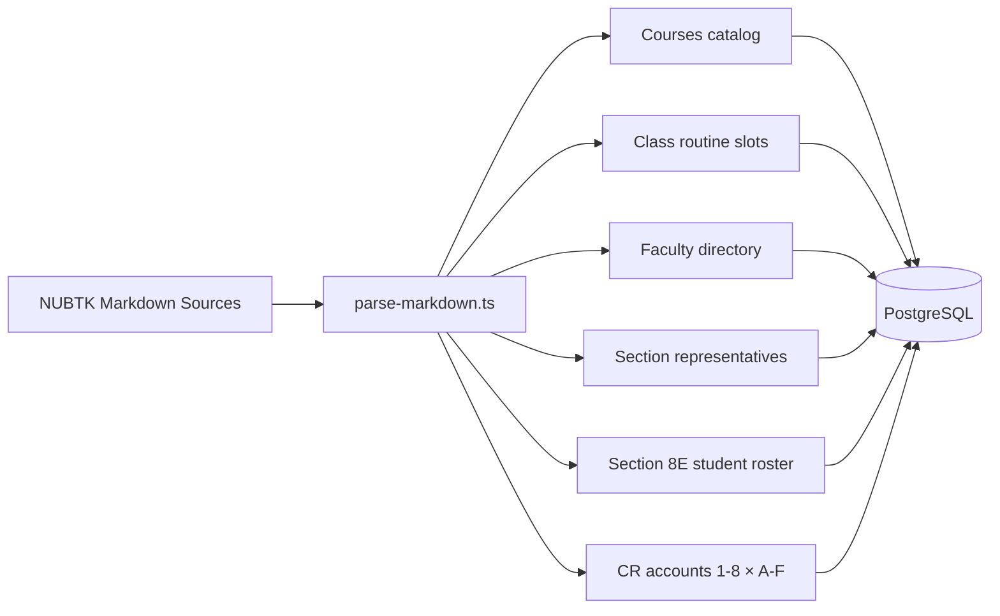

### What gets seeded

| Data | Description |
|------|-------------|
| **Courses** | All CSE courses with codes, names, semesters |
| **Class routine** | Weekly schedule slots (day, time, room, section, teacher acronym) |
| **Faculty** | Academic faculty directory for the term |
| **Section representatives** | CR/ACR contact records |
| **Section 8E students** | Full student roster with course enrollments |
| **CR accounts** | One scoped teacher account per semester × section |

### Seed commands

| Command | Description |
|---------|-------------|
| `npm run db:seed` | Incremental NUBTK import |
| `npm run db:seed:fresh` | Clear routine/reference data and re-import |
| `npm run db:seed:legacy` | Legacy generic seed script |

### Account setup after seeding

After seeding, accounts are created with institution-specific formats:

- **Students:** email `{studentId}@gmail.com`, password set to their student ID
- **CR accounts:** email `cr{semester}{section}@gmail.com`, password matches the email local part
- **Admin:** must be created via registration or manual database insert

> Configure credentials through your institution's account provisioning process. Do not commit real passwords or secrets to version control.

---

## Scripts Reference

### Server (`server/`)

| Script | Description |
|--------|-------------|
| `npm run dev` | Start dev server with hot reload (tsx watch) |
| `npm run build` | Compile TypeScript to `dist/` |
| `npm start` | Run production build |
| `npm run db:generate` | Generate Drizzle migration files |
| `npm run db:migrate` | Apply migrations |
| `npm run db:push` | Push schema directly (dev) |
| `npm run db:seed` | Seed NUBTK data |
| `npm run db:seed:fresh` | Fresh NUBTK seed |
| `npm run db:seed:legacy` | Legacy seed |

### Client (`client/`)

| Script | Description |
|--------|-------------|
| `npm run dev` | Start Vite dev server |
| `npm run build` | TypeScript check + production build |
| `npm run preview` | Preview production build |
| `npm run lint` | ESLint |

---

## Deployment

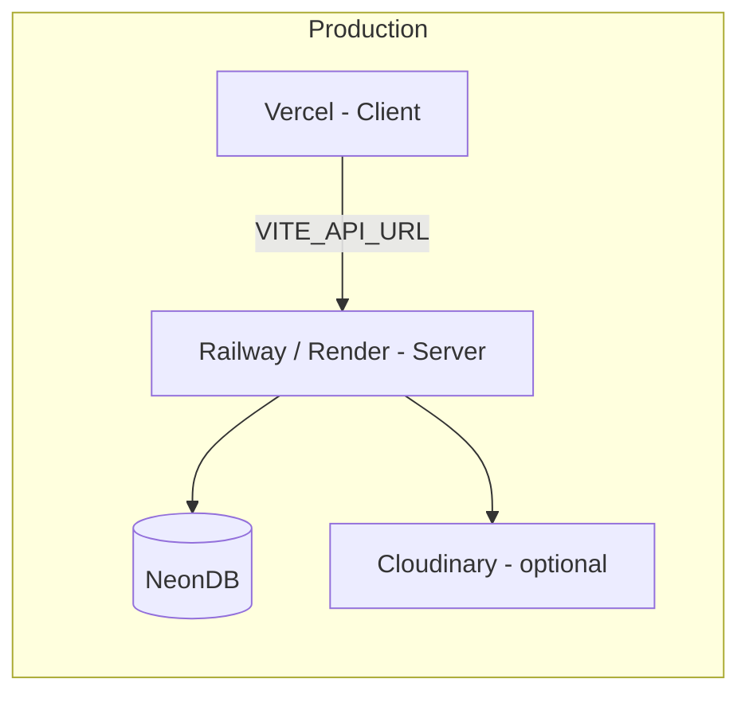

### Client (Vercel)

1. Connect the `client/` directory
2. Set `VITE_API_URL` to your production API URL
3. Build command: `npm run build`
4. Output directory: `dist`

### Server (Railway / Render)

1. Connect the `server/` directory
2. Set all server environment variables
3. Build command: `npm run build`
4. Start command: `npm start`
5. Run `npm run db:migrate` on deploy

### Production checklist

- [ ] Set strong `JWT_ACCESS_SECRET` and `JWT_REFRESH_SECRET`
- [ ] Set `NODE_ENV=production`
- [ ] Set `CLIENT_URL` to production frontend URL
- [ ] Set `SERVER_URL` to production backend URL
- [ ] Configure `DATABASE_URL` for production NeonDB branch
- [ ] Enable HTTPS (required for secure cookies)
- [ ] Set `secure: true` and `sameSite: none` on refresh cookies (automatic in production)
- [ ] Configure Resend for password reset emails
- [ ] Configure Cloudinary or ensure upload directory is persisted
- [ ] Disable open registration unless intended (`ALLOW_ADMIN_REGISTER`, `ALLOW_STUDENT_REGISTER`)

---

## System Settings

Configurable via Admin → Settings (stored in `system_settings`):

| Key | Default | Description |
|-----|---------|-------------|
| `attendance_threshold` | `75` | Minimum attendance percentage |
| `academic_year` | `2025-2026` | Display academic year |
| `current_semester` | `8` | Active semester for defaults |
| `app_mode` | `general` | `general` or `advanced` UI mode |

---

## License & Attribution

Built for university CSE department attendance management. Tailored for NUBTK academic data structures including routine parsing, faculty directories, and section representative records.
